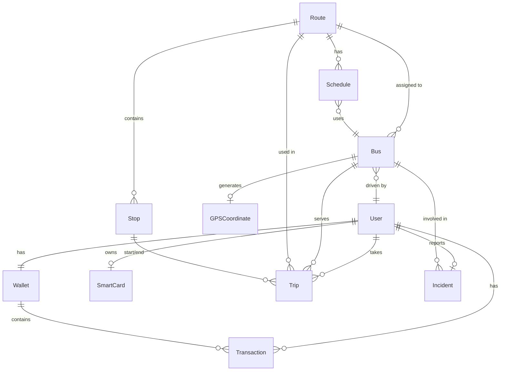

# SUMS Backend API Documentation

## Overview

Smart Urban Mobility System (SUMS) Backend - A comprehensive public transportation management system built with Express, TypeScript, Sequelize, and PostgreSQL.

**Base URL:** `http://localhost:5001/api/v1`

**Technology Stack:**
- **Framework:** Express.js
- **Language:** TypeScript
- **ORM:** Sequelize
- **Database:** PostgreSQL
- **Authentication:** JWT (JSON Web Tokens)
- **Validation:** Zod
- **Payment Integration:** Telebirr
- **Documentation:** Swagger/OpenAPI

---

## Architecture Overview

```
┌─────────────────────────────────────────────────────────────────┐
│                         API Gateway Layer                         │
│                        (Express Router)                           │
└─────────────────────────────────────────────────────────────────┘
                              │
                              ▼
┌─────────────────────────────────────────────────────────────────┐
│                      Middleware Layer                             │
│  • Authentication (JWT)                                          │
│  • Role-based Authorization                                      │
│  • Request Validation (Zod)                                      │
│  • Rate Limiting                                                 │
└─────────────────────────────────────────────────────────────────┘
                              │
                              ▼
┌─────────────────────────────────────────────────────────────────┐
│                      Controller Layer                             │
│         (Handles HTTP Request/Response)                          │
└─────────────────────────────────────────────────────────────────┘
                              │
                              ▼
┌─────────────────────────────────────────────────────────────────┐
│                       Service Layer                               │
│         (Business Logic Implementation)                           │
└─────────────────────────────────────────────────────────────────┘
                              │
                              ▼
┌─────────────────────────────────────────────────────────────────┐
│                      Data Access Layer                            │
│              (Sequelize ORM Models)                               │
└─────────────────────────────────────────────────────────────────┘
                              │
                              ▼
┌─────────────────────────────────────────────────────────────────┐
│                     PostgreSQL Database                           │
└─────────────────────────────────────────────────────────────────┘
```

---

## Database Schema & Relationships



---

## API Endpoints

### Authentication Module (`/auth`)

| Method | Endpoint | Auth Required | Role | Description |
|--------|----------|---------------|------|-------------|
| POST | `/auth/register` | No | - | Register a new passenger |
| POST | `/auth/create-driver` | Yes | Admin | Create a new driver account |
| POST | `/auth/login/passenger` | No | - | Login as passenger |
| POST | `/auth/login/driver` | No | - | Login as driver |
| POST | `/auth/login/admin` | No | - | Login as admin |
| POST | `/auth/refresh-token` | Yes | - | Refresh JWT token |
| POST | `/auth/logout` | Yes | - | Logout user |

**Controller:** `AuthController`
**Service:** `AuthService`
**Schema:** `auth.schema.ts`

#### Request/Response Schemas

**Register Passenger:**
```json
{
  "body": {
    "fullName": "string (required)",
    "email": "string (email, required)",
    "phone": "string (optional)",
    "password": "string (min 6 chars, required)"
  }
}
```

**Create Driver:**
```json
{
  "body": {
    "fullName": "string (required)",
    "email": "string (email, required)",
    "phone": "string (optional)",
    "password": "string (min 6 chars, required)",
    "licenseNumber": "string (required)"
  }
}
```

**Login:**
```json
{
  "body": {
    "phone": "string (required)",
    "password": "string (required)"
  }
}
```

---

### User Module (`/users`)

| Method | Endpoint | Auth Required | Role | Description |
|--------|----------|---------------|------|-------------|
| GET | `/users/profile` | Yes | Any | Get current user profile |
| PUT | `/users/profile` | Yes | Any | Update current user profile |
| GET | `/users` | Yes | Admin | Get all users (paginated) |
| GET | `/users/:id` | Yes | Admin | Get user by ID |
| PUT | `/users/:id/status` | Yes | Admin | Update user status |

**Controller:** `UserController`
**Service:** `UserService`
**Schema:** `user.schema.ts`
**Model:** `User`

#### User Model Schema
```typescript
{
  id: string (UUID),
  fullName: string,
  email: string (unique),
  phone: string (unique, optional),
  password: string (hashed),
  role: 'passenger' | 'driver' | 'admin',
  status: 'active' | 'suspended' | 'inactive',
  createdAt: Date,
  updatedAt: Date
}
```

---

### Bus Module (`/buses`)

| Method | Endpoint | Auth Required | Role | Description |
|--------|----------|---------------|------|-------------|
| POST | `/buses` | Yes | Admin | Create a new bus |
| GET | `/buses` | No | - | Get all buses (paginated) |
| GET | `/buses/:id` | No | - | Get bus by ID |
| PUT | `/buses/:id` | Yes | Admin, Driver | Update bus details |
| DELETE | `/buses/:id` | Yes | Admin | Delete a bus |

**Controller:** `BusController`
**Service:** `BusService`
**Schema:** `bus.schema.ts`
**Model:** `Bus`

#### Bus Model Schema
```typescript
{
  id: string (UUID),
  registrationNumber: string (unique),
  driverId: string (UUID, references users),
  routeId: string (UUID, references routes),
  capacity: number,
  currentPassengers: number (default: 0),
  status: 'active' | 'inactive' | 'maintenance',
  createdAt: Date,
  updatedAt: Date
}
```

---

### Card Module (`/cards`)

| Method | Endpoint | Auth Required | Role | Description |
|--------|----------|---------------|------|-------------|
| POST | `/cards/activate` | Yes | Passenger | Activate a smart card |
| GET | `/cards/my-card` | Yes | Passenger | Get user's card details |
| PUT | `/cards/link-telebirr` | Yes | Passenger | Link card to Telebirr account |
| GET | `/cards` | Yes | Admin | Get all cards (paginated) |
| GET | `/cards/:cardId` | Yes | Admin | Get card by ID |
| PUT | `/cards/:cardId/status` | Yes | Admin | Update card status |

**Controller:** `CardController`
**Service:** `CardService`
**Schema:** `card.schema.ts`
**Model:** `SmartCard`

#### SmartCard Model Schema
```typescript
{
  id: string (UUID),
  cardId: string (unique),
  userId: string (UUID, references users),
  status: 'ACTIVE' | 'SUSPENDED',
  telebirrPhone: string (optional),
  activatedAt: Date (optional),
  lastUsedAt: Date (optional),
  createdAt: Date,
  updatedAt: Date
}
```

---

### Driver Module (`/driver`)

| Method | Endpoint | Auth Required | Role | Description |
|--------|----------|---------------|------|-------------|
| POST | `/driver/trip/start` | Yes | Driver | Start a new trip |
| PUT | `/driver/trip/end` | Yes | Driver | End current trip |
| GET | `/driver/trip/current` | Yes | Driver | Get current active trip |
| GET | `/driver/route` | Yes | Driver | Get assigned route |
| GET | `/driver/trip/history` | Yes | Driver | Get trip history |

**Controller:** `DriverController`
**Service:** `DriverService`

---

### GPS Module (`/gps`)

| Method | Endpoint | Auth Required | Role | Description |
|--------|----------|---------------|------|-------------|
| POST | `/gps/record` | Yes | Driver | Record GPS coordinates |
| GET | `/gps/latest/:busId` | No | - | Get latest GPS data for bus |
| GET | `/gps/track/:busId` | No | - | Get GPS track history |

**Controller:** `GPSController`
**Service:** `GPSService`
**Schema:** `gps.schema.ts`
**Model:** `GPSCoordinate`

#### GPSCoordinate Model Schema
```typescript
{
  id: string (UUID),
  busId: string (UUID, references buses),
  latitude: number,
  longitude: number,
  accuracy: number (optional),
  speed: number (optional),
  heading: number (optional),
  timestamp: Date,
  createdAt: Date,
  updatedAt: Date
}
```

---

### Incident Module (`/incidents`)

| Method | Endpoint | Auth Required | Role | Description |
|--------|----------|---------------|------|-------------|
| POST | `/incidents` | Yes | Any | Report a new incident |
| GET | `/incidents/:id` | Yes | Any | Get incident by ID |
| GET | `/incidents` | Yes | Any | Get all incidents (paginated, filterable) |
| PUT | `/incidents/:id/status` | Yes | Any | Update incident status |

**Controller:** `IncidentController`
**Service:** `IncidentService`
**Schema:** `incident.schema.ts`
**Model:** `Incident`

#### Incident Model Schema
```typescript
{
  id: string (UUID),
  busId: string (UUID, references buses),
  type: string,
  severity: 'low' | 'medium' | 'high' | 'critical',
  description: string,
  reportedBy: string (UUID, references users),
  status: 'open' | 'acknowledged' | 'resolved',
  createdAt: Date,
  updatedAt: Date
}
```

---

### Route Module (`/routes`)

| Method | Endpoint | Auth Required | Role | Description |
|--------|----------|---------------|------|-------------|
| POST | `/routes` | Yes | Admin | Create a new route |
| GET | `/routes` | Yes | Any | Get all routes (paginated, filterable) |
| GET | `/routes/:routeId` | Yes | Any | Get route by ID |
| PUT | `/routes/:routeId` | Yes | Admin | Update route details |
| DELETE | `/routes/:routeId` | Yes | Admin | Delete a route |

**Controller:** `RouteController`
**Service:** `RouteService`
**Schema:** `route.schema.ts`
**Model:** `Route`

#### Route Model Schema
```typescript
{
  id: string (UUID),
  name: string,
  startPoint: string,
  endPoint: string,
  distance: number,
  estimatedDuration: number (minutes),
  status: 'active' | 'inactive',
  createdAt: Date,
  updatedAt: Date
}
```

---

### Stop Module (`/stops`)

| Method | Endpoint | Auth Required | Role | Description |
|--------|----------|---------------|------|-------------|
| GET | `/stops` | Yes | Any | Get all stops |
| GET | `/stops/:id` | Yes | Any | Get stop by ID |
| POST | `/stops` | Yes | Admin | Create a new stop |
| PUT | `/stops/:id` | Yes | Admin | Update stop details |

**Controller:** `StopController`
**Service:** `StopService`
**Schema:** `stop.schema.ts`
**Model:** `Stop`

#### Stop Model Schema
```typescript
{
  id: string (UUID),
  name: string,
  routeId: string (UUID, references routes),
  latitude: number,
  longitude: number,
  sequenceNumber: number,
  createdAt: Date,
  updatedAt: Date
}
```

---

### Telebirr Module (`/telebirr`)

| Method | Endpoint | Auth Required | Role | Description |
|--------|----------|---------------|------|-------------|
| POST | `/telebirr/checkout-url` | No | - | Generate Telebirr checkout URL |

**Controller:** `TelebirrController`
**Service:** `WalletTelebirrService`
**Schema:** `telebirr.schema.ts`

---

### TelebirrH5 Module (`/telebirr-h5`)

| Method | Endpoint | Auth Required | Role | Description |
|--------|----------|---------------|------|-------------|
| POST | `/telebirr-h5/token` | No | - | Request access token |
| POST | `/telebirr-h5/auth-token` | No | - | Exchange for auth token |
| POST | `/telebirr-h5/preorder` | No | - | Create preorder payment |
| POST | `/telebirr-h5/refund` | No | - | Process refund |
| POST | `/telebirr-h5/notify` | No | - | Payment notification webhook |

**Controller:** `TelebirrH5Controller`
**Service:** `TelebirrH5Service`
**Schema:** `telebirrH5.schema.ts`

---

### Trip Module (`/trips`)

| Method | Endpoint | Auth Required | Role | Description |
|--------|----------|---------------|------|-------------|
| POST | `/trips` | Yes | Any | Create a new trip (boarding) |
| GET | `/trips/history/passenger` | Yes | Passenger | Get passenger trip history |
| GET | `/trips/:id` | Yes | Any | Get trip by ID |
| GET | `/trips/user/:userId` | Yes | Admin | Get trips by user |
| PUT | `/trips/:id/complete` | Yes | Any | Complete trip (deboarding) |
| PUT | `/trips/:id/cancel` | Yes | Any | Cancel ongoing trip |
| GET | `/trips` | Yes | Admin | Get all trips (paginated) |

**Controller:** `TripController`
**Service:** `TripService`
**Schema:** `trip.schema.ts`
**Model:** `Trip`

#### Trip Model Schema
```typescript
{
  id: string (UUID),
  userId: string (UUID, references users),
  busId: string (UUID, references buses),
  routeId: string (UUID, references routes),
  startStopId: string (UUID, references stops),
  endStopId: string (UUID, references stops),
  startTime: Date,
  endTime: Date (optional),
  fare: number,
  status: 'ongoing' | 'completed' | 'cancelled',
  createdAt: Date,
  updatedAt: Date
}
```

---

### Wallet Module (`/wallet`)

| Method | Endpoint | Auth Required | Role | Description |
|--------|----------|---------------|------|-------------|
| GET | `/wallet` | Yes | Passenger, Admin | Get wallet balance |
| POST | `/wallet/topup` | Yes | Passenger | Initiate wallet top-up |
| POST | `/wallet/webhook/telebirr` | No | - | Telebirr webhook listener |
| GET | `/wallet/transactions` | Yes | Passenger | Get transaction history |
| POST | `/wallet/deduct` | Yes | Admin, Driver, System | Deduct amount from wallet |
| GET | `/wallet/admin/revenue` | Yes | Admin | Get overall revenue |
| GET | `/wallet/admin/transactions` | Yes | Admin | Get all transactions globally |

**Controller:** `WalletController`
**Service:** `WalletService`
**Schema:** `wallet.schema.ts`
**Model:** `Wallet`, `Transaction`

#### Wallet Model Schema
```typescript
{
  id: string (UUID),
  userId: string (UUID, references users, unique),
  balance: number (DECIMAL(10,2), default: 0),
  currency: string (default: 'ETB'),
  createdAt: Date,
  updatedAt: Date
}
```

#### Transaction Model Schema
```typescript
{
  id: string (UUID),
  userId: string (UUID, references users),
  type: 'debit' | 'credit',
  amount: number (DECIMAL(10,2)),
  description: string,
  reference: string (optional),
  outTradeNo: string (optional),
  status: 'pending' | 'completed' | 'failed',
  createdAt: Date,
  updatedAt: Date
}
```

---

### Schedule Module (`/schedule`)

| Method | Endpoint | Auth Required | Role | Description |
|--------|----------|---------------|------|-------------|
| GET | `/schedule/route/:routeId` | Yes | Any | Get schedules for a route |
| POST | `/schedule` | Yes | Admin | Create a new schedule |
| PUT | `/schedule/:scheduleId` | Yes | Admin | Update schedule |

**Controller:** `ScheduleController`
**Service:** `ScheduleService`
**Schema:** `schedule.schema.ts`
**Model:** `Schedule`

#### Schedule Model Schema
```typescript
{
  id: string (UUID),
  routeId: string (UUID, references routes),
  busId: string (UUID, references buses, optional),
  dayOfWeek: number (0-6, 0=Sunday),
  departureTime: string (HH:mm format),
  arrivalTime: string (HH:mm format),
  isActive: boolean (default: true),
  createdAt: Date,
  updatedAt: Date
}
```

---

## Authentication & Authorization

### JWT Token Structure

```json
{
  "userId": "string (UUID)",
  "role": "passenger | driver | admin",
  "phone": "string",
  "iat": "number (issued at)",
  "exp": "number (expiration)"
}
```

### Role-Based Access Control (RBAC)

| Role | Permissions |
|------|-------------|
| **passenger** | Register, login, manage profile, create/complete trips, manage wallet, activate card, report incidents |
| **driver** | Login, manage assigned bus, start/end trips, record GPS data, get assigned route, view trip history |
| **admin** | All passenger permissions + manage users, buses, routes, stops, schedules, view all transactions, view revenue, manage incidents |

### Authentication Headers

```
Authorization: Bearer <JWT_TOKEN>
```

---

## Request/Response Format

### Success Response

```json
{
  "success": true,
  "message": "Operation successful",
  "data": { ... }
}
```

### Error Response

```json
{
  "success": false,
  "message": "Error description",
  "error": "Detailed error information (optional)"
}
```

### Pagination

Most list endpoints support pagination via query parameters:

```
?page=1&limit=10
```

**Response format:**

```json
{
  "success": true,
  "data": {
    "items": [...],
    "total": 100,
    "page": 1,
    "limit": 10,
    "pages": 10
  }
}
```

---

## Validation Schemas (Zod)

All requests are validated using Zod schemas. Each module has its own schema file defining validation rules for:

- Request body parameters
- Query parameters
- Route parameters
- Response data

Example validation error:

```json
{
  "success": false,
  "message": "Validation error",
  "errors": [
    {
      "field": "email",
      "message": "Please provide a valid email address"
    }
  ]
}
```

---

## Error Codes

| Status Code | Description |
|-------------|-------------|
| 200 | Success |
| 201 | Created |
| 204 | No Content |
| 400 | Bad Request (Validation error) |
| 401 | Unauthorized (Invalid/missing token) |
| 403 | Forbidden (Insufficient permissions) |
| 404 | Not Found |
| 409 | Conflict (Resource already exists) |
| 500 | Internal Server Error |

---

## Payment Integration (Telebirr)

### Payment Flow

1. **Initiate Payment:** Client calls `/wallet/topup` with amount
2. **Create Transaction:** System creates pending transaction
3. **Generate Checkout URL:** Telebirr service generates payment URL
4. **User Payment:** User completes payment via Telebirr
5. **Webhook Notification:** Telebirr sends payment status to `/wallet/webhook/telebirr`
6. **Update Transaction:** System updates transaction status and wallet balance

### Webhook Signature Verification

Webhooks can be secured using HMAC-SHA256 signature verification:

```
X-Telebirr-Signature: <signature>
```

Configure `TELEBIRR_WEBHOOK_SECRET` in environment variables.

---

## WebSocket Support

The system supports real-time updates via WebSocket for:

- Real-time GPS tracking
- Live trip updates
- Incident notifications
- Payment status updates

**WebSocket Endpoint:** `ws://localhost:5001`

---

## Environment Variables

Required environment variables:

```env
# Server
PORT=5001
NODE_ENV=development

# Database
DB_HOST=localhost
DB_PORT=5432
DB_NAME=sums_db
DB_USER=postgres
DB_PASSWORD=your_password

# JWT
JWT_SECRET=your_jwt_secret
JWT_EXPIRES_IN=24h

# Telebirr
TELEBIRR_BASE_URL=https://api.telebirr.com
TELEBIRR_TOKEN_URL=https://api.telebirr.com/payment/v1/token
TELEBIRR_CREATE_ORDER_URL=https://api.telebirr.com/payment/v1/app/checkout
TELEBIRR_FABRIC_APP_ID=your_app_id
TELEBIRR_APP_SECRET=your_app_secret
TELEBIRR_PRIVATE_KEY=your_private_key
TELEBIRR_NOTIFY_URL=http://localhost:5001/api/v1/wallet/webhook/telebirr
TELEBIRR_RETURN_URL=http://localhost:3000/payment/success
TELEBIRR_WEBHOOK_SECRET=your_webhook_secret
TELEBIRR_ALLOW_SELF_SIGNED=false
```

---

## Module Dependencies

### Auth Module
- Depends on: User, Wallet, SmartCard models
- Creates: User, Wallet, SmartCard on passenger registration

### Trip Module
- Depends on: User, Bus, Route, Stop models
- Integrates with: Wallet (for fare deduction)

### Wallet Module
- Depends on: User, Transaction models
- Integrates with: Telebirr (for payment processing)

### GPS Module
- Depends on: Bus model
- Used by: Driver module for real-time tracking

### Schedule Module
- Depends on: Route, Bus models
- Manages: Bus-route assignments and timing

---

## API Testing

### Using Swagger UI

Access interactive API documentation at:
```
http://localhost:5001/api-docs
```

### Example cURL Commands

**Register Passenger:**
```bash
curl -X POST http://localhost:5001/api/v1/auth/register \
  -H "Content-Type: application/json" \
  -d '{
    "fullName": "John Doe",
    "email": "john@example.com",
    "phone": "+251911234567",
    "password": "password123"
  }'
```

**Login:**
```bash
curl -X POST http://localhost:5001/api/v1/auth/login/passenger \
  -H "Content-Type: application/json" \
  -d '{
    "phone": "+251911234567",
    "password": "password123"
  }'
```

**Get All Routes:**
```bash
curl -X GET http://localhost:5001/api/v1/routes \
  -H "Authorization: Bearer <JWT_TOKEN>"
```

---

## Development Guidelines

### Adding a New Module

1. Create module directory: `src/modules/<module-name>/`
2. Create files:
   - `<module>.routes.ts` - Route definitions
   - `<module>.controller.ts` - Request handlers
   - `<module>.service.ts` - Business logic
   - `<module>.schema.ts` - Validation schemas
   - `<module>.model.ts` - Database model (if needed)
3. Add route to main router in `src/routes.ts`
4. Export model from `src/modules/models/index.ts`
5. Add Swagger documentation annotations

### Code Structure Pattern

```
src/modules/<module>/
├── <module>.routes.ts      # Express router with endpoints
├── <module>.controller.ts  # HTTP request/response handlers
├── <module>.service.ts      # Business logic implementation
├── <module>.schema.ts       # Zod validation schemas
└── <module>.model.ts        # Sequelize model definition
```

---

## Support & Contact

For API support or questions:
- **Documentation:** This file
- **Swagger UI:** `/api-docs`
- **Logs:** Check `/logs` directory
- **Database:** PostgreSQL connection details in config

---

**Last Updated:** April 28, 2026
**API Version:** 1.0.0
